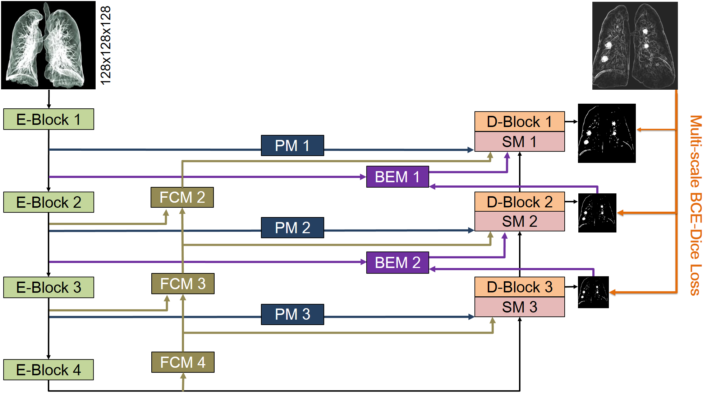

# MANet
MANet : Multi-branch attention auxiliary learning for lung nodule detection and segmentation

##  License
Copyright (C) 2019 University of California Irvine and DEEPVOXEL Inc. All rights reserved. Licensed under the CC BY-NC-SA 4.0 license ([https://creativecommons.org/licenses/by-nc-sa/4.0/legalcode](<https://creativecommons.org/licenses/by-nc-sa/4.0/legalcode>)).

##  Introduction

This repository contains the PyTorch implementation of MANet, Multi-branch attention auxiliary learning for lung nodule detection and segmentation. 
As shown in the figure below, our UNet-based network architecture consists of 4 layers with two main branches, namely Encoder and Decoder. The output of each D-Block combined with the downsampling ground truth of the corresponding size is used for training to generate a semantic mask. This application helps the UNet architecture to represent better features that are suitable for various sizes of lung nodules at each layer. Besides, the processed features of E-Blocks are also fed in a number of modules, such as the Projected Module (PM), Fast Cascading Context Module (FCM), and Boundary Enhancement Module (BEM), with the role to exploit high-frequency information and to integrate contextual information. These modules help enhance the ability to represent the features of the object to be recognized. The three modules' and the Decoder branch's outputs are then aggregated at the Synthesis Module (SM) block.



##  Install dependencies

Dependent libraries
* torch
* torchvision 
* opencv
* tqdm
* tb-nightly
* pynrrd
* SimpleITK
* pydicom

Install a custom module for bounding box NMS and overlap calculation.

```bask
cd scripts/build/box
python setup.py install
```

##  Lung nodule dataset
The dataset that has nodule segmentation is the public LIDC dataset. More common dataset would be the ones like LUNA16 that only has nodule locations. First, we need to preprocess the dicom images. The preprocessing includes: segmenting lung regions from the CT image, resampling the image into 1x1x1 mm spacing and converting world coordinates to voxel coordinates. All the results will be saved as .npy files. Then, you will need to specify which samples to be used for training, validing and testing. This can be done by generating a csv files containing patient ids for each phase and specify their paths in the scripts/config.py 

we hereby walk you through the configuration to generate the preprocessed data for training and evaluation. 
1. Download the LIDC-IDRI Radiologist Annotations/Segmentations (XML format) from https://wiki.cancerimagingarchive.net/download/attachments/1966254/LIDC-XML-only.zip?version=1&modificationDate=1530215018015&api=v2 and change the scripts/config.py line 24 'annos_dir' to your downloaded path

2. Download the LIDC-IDRI CT images and the corresponding lung segmentation mask from LUNA16 challenge https://luna16.grand-challenge.org/Download/

    Move all downloaded CT images from the 10 folders to one folder, and change the scripts/config.py line 18 'data_dir' to the CT images directory (combining sub folders into one folder) and change the scripts/config.py line 27 'lung_mask_dir' to the segmentation mask.

    Explanantions on some intermediate results saved: ctr_arr_save_dir will be the place to save the parsed intermediate nodule masks for each annotator, and mask_save_dir is the folder to save the merged nodule mask. In mask_save_dir, there will be 1 - 4 four folders, containing nodule masks that are annotated by at least 1 - 4 annotators respectively.

3. Then run 
```
cd scripts/utils/LIDC
python cvrt_annos_to_npy.py
```

4. Finally, we will resample the CT image to 1x1x1, as well as the nodule masks. All our training and evaluations are based on the resampled images. Go to scripts/utils/LIDC/preprocess.py, change lung_mask_dir to the lung segmentation mask you downloaded from step 2, nod_mask_dir to the mask_save_dir you specified in the previous step. Change save_dir to the place you want to save the preprocessed data. Then run
```
cd scripts/utils/LIDC
python preprocess.py
```

##  Usage

####  1. Training

```bash
bash train_single_fold.sh $fold $checkpoint
```
* $fold: Fold's index is specified to model train. An integer value in the range 0 to 5.
* $checkpoint: is optional, specify the path to the checkpoint to resume training the model.


####  2. Inference

```bash
python test.py --mode "eval" --test-set-name $testsetname --weight $weight --out-dir $outdir
```
* $testsetname: Path to the csv file containing patient ids. There are 6 csv test files corresponding for 6 folds in scripts/split/cross_val/ for a six-fold cross-validation process
* $weight: Path to weight file.
* $outdir: Path to directory where inference results will be stored.

You will see the results of FROC analysis both saved to files and printed on the screen.


##  Acknowledgement

Part of the code was adpated from [NoduleNet: Decoupled False Positive Reduction for Pulmonary Nodule Detection and Segmentation](<https://github.com/uci-cbcl/NoduleNet>)

```bash
@INPROCEEDINGS{10.1007/978-3-030-32226-7_30,
    author="Tang, Hao and Zhang, Chupeng and Xie, Xiaohui",
    editor="Shen, Dinggang and Liu, Tianming and Peters, Terry M. and Staib, Lawrence H. and Essert, Caroline and Zhou, Sean and Yap, Pew-Thian and Khan, Ali",
    title="NoduleNet: Decoupled False Positive Reduction for Pulmonary Nodule Detection and Segmentation",
    booktitle="Medical Image Computing and Computer Assisted Intervention -- MICCAI 2019",
    year="2019",
    publisher="Springer International Publishing",
    address="Cham",
    pages="266--274",
    isbn="978-3-030-32226-7",
    doi="https://doi.org/10.1007/978-3-030-32226-7_30",
}
```
